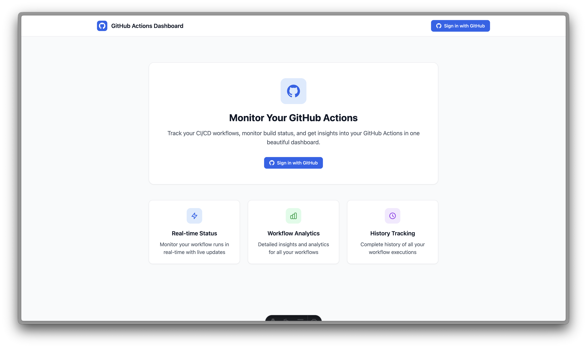
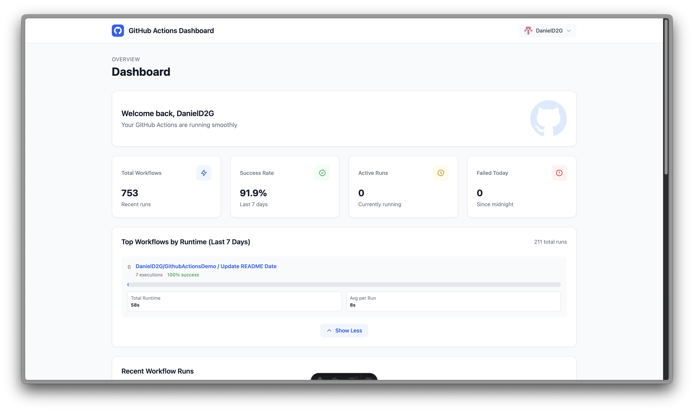
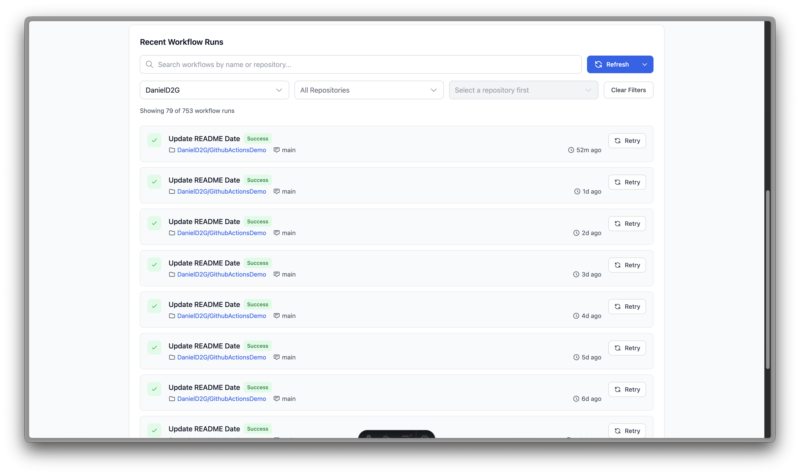
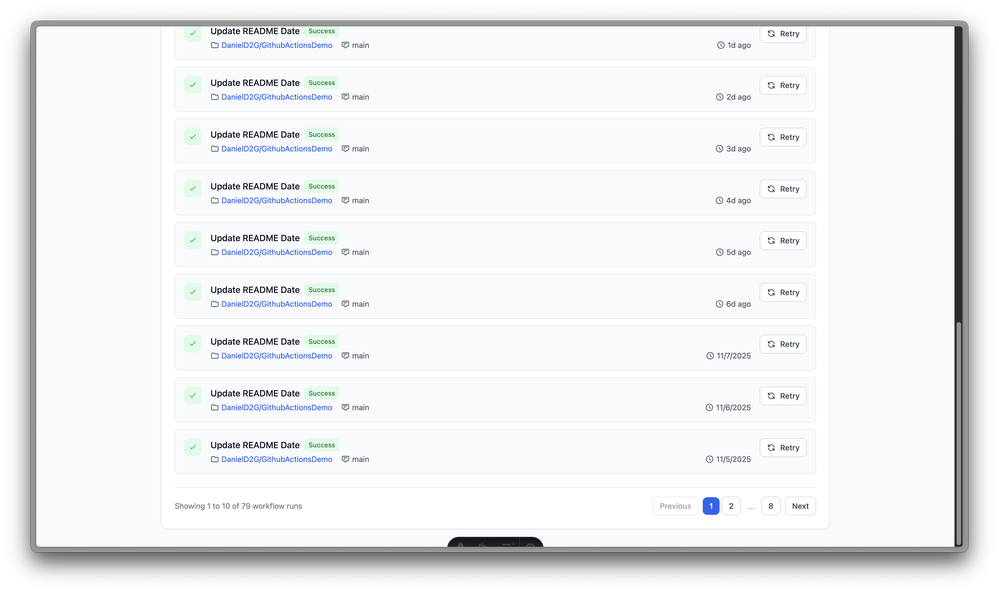
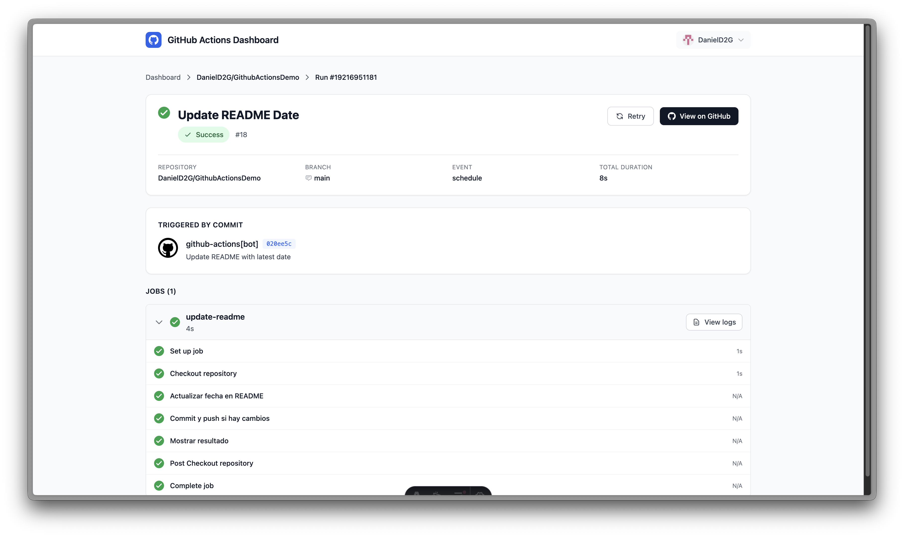

# Actions Hub

A modern, real-time dashboard for monitoring and managing GitHub Actions workflows across all your repositories. Built with Astro, Preact, and Tailwind CSS.

## 🌐 Try it Now

**Live Version Available!**, you can access the live dashboard at: **[actions-hub.dev](https://actions-hub.dev)**

Simply sign in with your GitHub account and start monitoring your workflows immediately - no setup required!







## 🔑 Prerequisites: Create a GitHub OAuth App

Before running the dashboard, you need to create a GitHub OAuth App:

1. Go to [GitHub Developer Settings](https://github.com/settings/developers)

2. Click **"New OAuth App"**

3. Fill in the application details:
   - **Application name**: `Actions Hub` (or your preferred name)
   - **Homepage URL**: `http://localhost:4321`
   - **Authorization callback URL**: `http://localhost:4321/api/auth/callback`

4. Click **"Register application"**

5. **Save the Client ID** (you'll need it below)

6. Click **"Generate a new client secret"** and **save the Client Secret** (you'll need it below)

7. **Generate a secure SESSION_SECRET**:
   ```bash
   openssl rand -base64 32
   ```
   Save this output, you'll need it for configuration.

---

## 🐳 Quick Run with Docker

Get started instantly with Docker (use your credentials from Prerequisites above):

```bash
docker run -p 4321:4321 \
  -e GITHUB_CLIENT_ID=your_github_client_id \
  -e GITHUB_CLIENT_SECRET=your_github_client_secret \
  -e GITHUB_CALLBACK_URL=http://localhost:4321/api/auth/callback \
  -e SESSION_SECRET=your_random_secret_here \
  ghcr.io/danield2g/ghadashboard:1.0.0
```

Then open http://localhost:4321 in your browser.

## 🐳 Quick Run with Docker Compose

Complete step-by-step setup:

### Step 1: Clone the repository

```bash
git clone https://github.com/DanielD2G/ActionsDashboard.git
cd ActionsDashboard
```

### Step 2: Create your `.env` file

```bash
cat > .env << 'EOF'
GITHUB_CLIENT_ID=your_github_client_id_here
GITHUB_CLIENT_SECRET=your_github_client_secret_here
GITHUB_CALLBACK_URL=http://localhost:4321/api/auth/callback
SESSION_SECRET=your_random_secret_here
# Optional: GITHUB_ORG=your-organization-name
EOF
```

Replace the placeholder values with your actual credentials from the Prerequisites section above.

### Step 3: Start the application

```bash
docker-compose up -d
```

### Step 4: Access the dashboard

Open http://localhost:4321 in your browser and sign in with GitHub!

---

**Useful commands**:
- **View logs**: `docker-compose logs -f`
- **Stop the application**: `docker-compose down`
- **Restart**: `docker-compose restart`
- **Update to latest version**: `docker-compose pull && docker-compose up -d`

## ✨ Features

- 🔐 **Secure OAuth Authentication** - Sign in with GitHub using OAuth 2.0
- 📊 **Real-time Workflow Monitoring** - Track workflow runs across all repositories
- 🔄 **Workflow Re-run** - Quickly re-run failed or all jobs with one click
- 📈 **Analytics & Statistics** - View success rates, active runs, and performance metrics
- 🎯 **Advanced Filtering** - Filter by repository, status, branch, or search by name
- 📝 **Detailed Logs** - View formatted logs with syntax highlighting and timestamps
- 🔔 **Batched Loading** - Efficient data loading with configurable batch processing
- 💾 **Smart Caching** - LocalStorage-based caching for improved performance
- 🎨 **Beautiful UI** - Modern, responsive design with Tailwind CSS
- 🏢 **Custom Branding** - Add your own logo for light and dark modes
- ⚡ **Lightning Fast** - Server-side rendering with Astro for optimal performance

## 💻 Development Setup

For local development with Node.js:

1. **Clone the repository**
   ```bash
   git clone https://github.com/DanielD2G/ActionsDashboard.git
   cd ActionsDashboard
   ```

2. **Install dependencies**
   ```bash
   npm install
   ```

3. **Configure environment variables**

   Copy the example environment file:
   ```bash
   cp .env.example .env
   ```

   Edit `.env` and add your credentials from the Prerequisites section above:
   ```env
   GITHUB_CLIENT_ID=your_github_client_id
   GITHUB_CLIENT_SECRET=your_github_client_secret
   GITHUB_CALLBACK_URL=http://localhost:4321/api/auth/callback
   SESSION_SECRET=your_random_secret_here

   # Optional: Restrict to a specific organization
   # GITHUB_ORG=my-organization
   ```

4. **Run the development server**
   ```bash
   npm run dev
   ```

   The application will be available at `http://localhost:4321`

## 🔧 Configuration

### Environment Variables

All environment variables are documented in `.env.example`:

| Variable               | Required         | Description                                                                                                                                                                             |
|------------------------|------------------|-----------------------------------------------------------------------------------------------------------------------------------------------------------------------------------------|
| `GITHUB_CLIENT_ID`     | Yes              | GitHub OAuth App Client ID                                                                                                                                                              |
| `GITHUB_CLIENT_SECRET` | Yes              | GitHub OAuth App Client Secret                                                                                                                                                          |
| `GITHUB_CALLBACK_URL`  | Yes              | OAuth callback URL (must match GitHub App settings)                                                                                                                                     |
| `SESSION_SECRET`       | Yes (Production) | Secret for signing session cookies (generate with `openssl rand -base64 32`)                                                                                                            |
| `GITHUB_ORG`           | No               | Organization name to restrict dashboard to (e.g., `my-company`). When set, only shows workflows from that organization's repositories. Leave empty to show all accessible repositories. |
| `IMAGE_URL_LIGHT`      | No               | Custom logo URL for light mode. Replaces the default logo with your branding. If only this is set, it's used for both modes.                                                            |
| `IMAGE_URL_DARK`       | No               | Custom logo URL for dark mode. Replaces the default logo with your branding. If only this is set, it's used for both modes.                                                             |
| `NODE_ENV`             | No               | Environment mode (`development` or `production`)                                                                                                                                        |

### Constants Configuration

The application uses centralized configuration in `src/lib/constants.ts`:

- **Authentication**: Session duration, cookie settings, OAuth configuration
- **Time & Delays**: Polling intervals, refresh delays, batch processing
- **Pagination**: Items per page, page ranges
- **API Limits**: GitHub API rate limits and batch sizes
- **Statistics**: Lookback periods, success thresholds
- **UI Dimensions**: Icon sizes, modal dimensions, component spacing

## 🔐 Security

### Session Management
- Sessions are stored in HTTP-only cookies (inaccessible to JavaScript)
- Cookies are signed using HMAC-SHA256 with `SESSION_SECRET`
- CSRF protection via OAuth `state` parameter
- Cookies use `secure` flag in production (HTTPS only)
- Sessions expire after 7 days

### Environment Variables
- **Never commit** `.env` to version control (already in `.gitignore`)
- Use different `SESSION_SECRET` values for development and production
- Rotate `SESSION_SECRET` periodically in production
- Store secrets in secure services (AWS Secrets Manager, Vault, etc.) for production

### OAuth Scopes
The application requests the following GitHub scopes:
- `repo`: Full access to repositories (required for private repos)
- `workflow`: Access to GitHub Actions workflows

## 🎨 Features in Detail

### Dashboard Statistics
- **Total Workflows**: Count of all workflow runs
- **Success Rate**: Percentage of successful runs (last 7 days)
- **Active Runs**: Currently running or queued workflows
- **Failed Today**: Failed runs in the last 24 hours

### Workflow Filtering
- **Search**: Filter by workflow name
- **Repository**: Filter by specific repository
- **Status**: Filter by workflow status (success, failure, running, etc.)
- **Branch**: Filter by git branch
- **Combined Filters**: Use multiple filters simultaneously

### Batch Loading System
The dashboard uses an intelligent batch loading system:
- Loads workflows in 8 configurable batches
- Covers the last 31 days of workflow history
- 3-second delay between batches to respect API rate limits
- Caches results in LocalStorage for performance
- Incremental refresh for new workflows

### Workflow Analytics
- **Top Workflows by Runtime**: Visual charts showing longest-running workflows
- **Success Rate Tracking**: Color-coded success rates (green ≥80%, yellow ≥50%, red <50%)
- **Performance Metrics**: Average duration, total runtime, run count
- **Historical Data**: 7-day lookback period for analytics

### Log Viewer
- **Syntax Highlighting**: Color-coded log levels (error, warning, success)
- **Timestamps**: Formatted timestamps for each log line
- **Group Detection**: Collapsible log groups (`##[group]`, `##[endgroup]`)
- **Line Numbers**: Easy reference for debugging
- **Search**: Find specific log entries
- **Statistics**: Log counts and timing information

## 📊 API Endpoints

### Authentication
- `GET /api/auth/login` - Initiate OAuth flow
- `GET /api/auth/callback` - Handle GitHub OAuth callback
- `POST /api/auth/logout` - Destroy session
- `GET /api/auth/me` - Get current user information

### Workflows
- `GET /api/workflows/recent` - Get recent workflow runs
- `GET /api/workflows/batch` - Get workflow runs in date range
- `GET /api/workflows/:owner/:repo/:runId` - Get workflow run details
- `POST /api/workflows/:owner/:repo/:runId/rerun` - Re-run workflow
- `GET /api/workflows/:owner/:repo/jobs/:jobId/logs` - Get job logs
- `POST /api/workflows/:owner/:repo/jobs/:jobId/rerun` - Re-run specific job

## 🧞 Commands

All commands are run from the root of the project:

| Command             | Action                                       |
|---------------------|----------------------------------------------|
| `npm install`       | Install dependencies                         |
| `npm run dev`       | Start development server at `localhost:4321` |
| `npm run build`     | Build production site to `./dist/`           |
| `npm run preview`   | Preview production build locally             |
| `npm run astro ...` | Run Astro CLI commands                       |

## 🚢 Deployment

### Build for Production

```bash
npm run build
```

This creates an optimized production build in the `./dist/` directory.


### Production Checklist

- [ ] Set strong `SESSION_SECRET` (use `openssl rand -base64 32`)
- [ ] Use different secrets for different environments
- [ ] Configure production GitHub OAuth App callback URL
- [ ] Set `NODE_ENV=production`
- [ ] Optionally set `GITHUB_ORG` to restrict dashboard to a specific organization
- [ ] Enable HTTPS (required for secure cookies)
- [ ] Configure proper CORS settings if needed
- [ ] Set up monitoring and error tracking
- [ ] Configure rate limiting for API endpoints
- [ ] Review and update GitHub OAuth scopes as needed

## 🛠️ Tech Stack

- **[Astro](https://astro.build)** - Modern static site builder with SSR
- **[Preact](https://preactjs.com)** - Fast 3kB alternative to React
- **[Tailwind CSS](https://tailwindcss.com)** - Utility-first CSS framework
- **[@octokit/rest](https://github.com/octokit/rest.js)** - GitHub REST API client
- **[@octokit/oauth-app](https://github.com/octokit/oauth-app.js)** - GitHub OAuth integration
- **[@astrojs/node](https://docs.astro.build/en/guides/integrations-guide/node/)** - Node.js SSR adapter

## 🤝 Contributing

Contributions are welcome! Please feel free to submit a Pull Request.

1. Fork the repository
2. Create your feature branch (`git checkout -b feature/AmazingFeature`)
3. Commit your changes (`git commit -m 'Add some AmazingFeature'`)
4. Push to the branch (`git push origin feature/AmazingFeature`)
5. Open a Pull Request

## 📝 Development Notes

- All magic numbers are centralized in `src/lib/constants.ts`
- All colors are centralized in `src/lib/constants.ts`
- Follow the existing code style and component patterns
- Use Preact hooks for state management in components
- Always use `client:load` directive for interactive components in Astro files
- API routes follow Astro's file-based routing convention

## 🐛 Troubleshooting

### OAuth not working
- Verify callback URL matches GitHub OAuth App settings exactly
- Check `GITHUB_CLIENT_ID` and `GITHUB_CLIENT_SECRET` in `.env`
- Ensure OAuth App has correct scopes (`repo`, `workflow`)
- Clear browser cookies and try again

### Styles not loading
- Run `npm install` to ensure Tailwind CSS is installed
- Check `tailwind.config.mjs` has correct content paths
- Verify `@astrojs/tailwind` integration is configured in `astro.config.mjs`

### API calls failing
- Check authentication session exists
- Verify GitHub token has required scopes
- Check GitHub API rate limits
- Review browser console for detailed error messages

### Session issues
- Ensure `SESSION_SECRET` is set in `.env`
- Clear browser cookies and LocalStorage
- Check that cookies are enabled in browser
- Verify HTTPS is enabled in production

## 📄 License

This project is open source and available under the [GNU Affero General Public License v3.0](LICENSE).

## 🙏 Acknowledgments

- Icons from [Heroicons](https://heroicons.com)
- GitHub API integration via [Octokit](https://github.com/octokit)

---

Made with ❤️ by the community